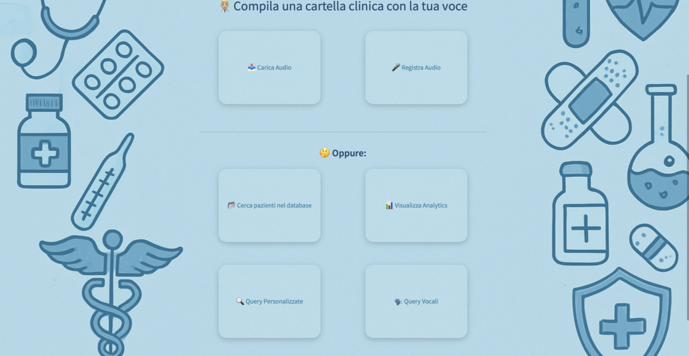
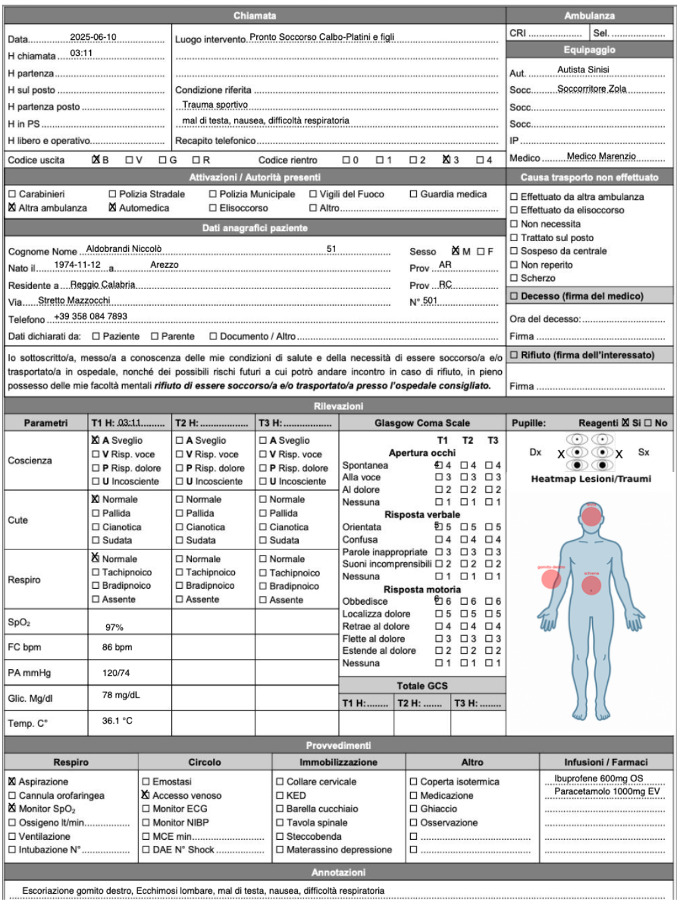

# 🎙️ Voice2Care

> **AI-Powered Speech-to-Store & Clinical Documentation**
> *Progetto finale per il corso di Big Data Engineering – A.A. 2024-2025*
> *Università degli Studi di Napoli Federico II*

<p align="center">
  
</p>

**Voice2Care** è una piattaforma avanzata progettata per semplificare la compilazione delle cartelle cliniche in contesti d'emergenza. Grazie all'integrazione di tecnologie Speech-to-Text e Modelli di Linguaggio (LLM), il sistema trasforma il parlato del medico in documentazione sanitaria strutturata, archiviata in un database NoSQL e visualizzata su mappe interattive.

---

## ✨ Funzionalità Principali

* 🗣️ **Trascrizione Vocale (STT):** Utilizzo del modello Whisper per convertire l'audio in testo con alta precisione clinica.
* 🧠 **Estrazione Dati con LLaMA 3:** Trasformazione del testo non strutturato in oggetti JSON (Anagrafica, Triage, Parametri).
* 📁 **Database Medico** Salvataggio dei dati del paziente in un database clinico 
* 📊 **Analisi Statistica:** Dashboard interattiva per monitorare il carico di lavoro e la gravità dei pazienti (Codici Triage).
* 🗺️ **Geolocalizzazione:** Mappe di calore per individuare la provenienza dei pazienti e monitorare focolai epidemiologici.
* 🩺 **Cartella clinica compilata in pdf** Possibilita di scaricare una cartella clinica completa compilata in pdf estraendo i dati dal file audio
---

## 🛠️ Come Funziona (Pipeline Tecnica)

Il progetto automatizza l'intero flusso di gestione del dato clinico:

### 1. Dalla Voce alla Cartella Completa
Il medico detta sintomi e parametri. Il sistema (via **LLaMA 3**) estrae le entità rilevanti e compila automaticamente tutti i campi. Il risultato finale non è solo un database aggiornato, ma una **cartella clinica digitale completa** che può essere scaricata istantaneamente in formato PDF professionale.
### 2. Monitoraggio del Reparto (Dashboard)
I dati salvati su **MongoDB** vengono aggregati in tempo reale per offrire una panoramica della situazione clinica.

<p align="center">
  
</p>

* **Triage Insight:** Visualizzazione immediata della saturazione del reparto tramite grafici a torta e a barre (Plotly).
* **Analisi Patologie:** Statistiche demografiche e cliniche per ottimizzare le risorse mediche.

### 3. Analisi Geografica e Prevenzione
Attraverso il modulo di geolocalizzazione, il sistema mappa la residenza dei pazienti per fornire strumenti di analisi territoriale.

* **Heatmap Interattiva:** Utilizzando **Folium**, vengono generate mappe di calore che evidenziano le aree urbane con maggior afflusso di pazienti, permettendo di identificare tempestivamente possibili emergenze sanitarie localizzate.

<p align="center">
  
</p>
---

## 💻 Stack Tecnologico

* **Frontend:** Streamlit
* **AI/NLP:** LLaMA 3 (Groq API) & OpenAI Whisper
* **Database:** MongoDB (NoSQL)
* **Geospatial:** Folium & Geopy
* **Data Viz:** Plotly & Pandas

---

## 🚀 Installazione e Avvio

1.  **Clona il repo:** `git clone https://github.com/gabman78/Voice2Care.git`
2.  **Installa dipendenze:** `pip install -r Project/requirements.txt`
3.  **Configura API:** Inserisci la tua `GROQ_API_KEY` nel file `.env`.
4.  **Avvia:** `streamlit run Project/layout.py`

---

## 📂 Struttura del Progetto

```text
Voice2Care/
├── Project/
│   ├── layout.py             # UI e Dashboard principale
│   ├── speech2txt.py         # Trascrizione audio (Whisper)
│   ├── compiLLaMA.py         # Integrazione LLM (LLaMA 3)
│   ├── mongo.py              # Gestione Database MongoDB
│   └── heatmap.py            # Generazione mappe e analisi Geo
├── logo.png                  # Logo ufficiale
└── Documentazione.pdf        # Documentazione tecnica completa
